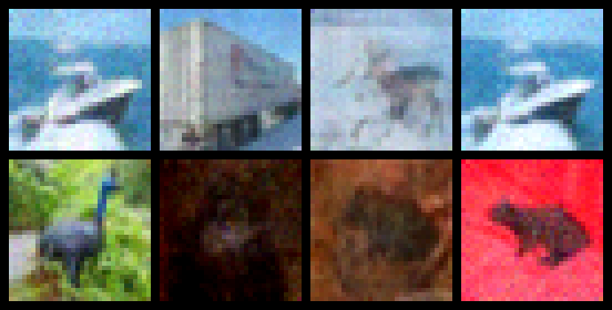

# Simple Diffusion

This repository contains a Jupyter notebook for PyTorch implementation of a simple diffusion model without text embeddings.

## Problem Definition
The process of generating images with diffusion models can be broken down into two major steps. An image containing only noise is generated. The model then iteratively denoises the image. The model does not know what the quality of the image is, it simply predicts the noise in each step. The predicted noise is removed and the output is used as the input for the next step. If the process has been implemented correctly a sufficient number of steps should result in a coherent image. Theoretical background can be found in [Denoising Diffusion Probabilistic Models [1]](https://arxiv.org/abs/2006.11239). Inspiration by [DeepFindr's "Diffusion models from scratch in PyTorch"](https://youtu.be/a4Yfz2FxXiY) and [Outlier's "Diffusion Models | PyTorch Implementation"](https://youtu.be/TBCRlnwJtZU).

## Implementation and Training
The included model is based on [minDiffusion](https://github.com/cloneofsimo/minDiffusion). Sinusoidal timestep embeddings implementation is taken from [Hugging Face Blog](https://huggingface.co/blog/annotated-diffusion).
The model is trained to denoise one step at a time by taking a ground truth image as the target output and the same image with noise added to it as input. The information about the amount of noise in the image is passed to the model as timestep embeddings.
Training was done on a small batch to prove the implementation was working. Because of this no model is provided in the repository. Tangible results can be expected after 3000 epochs on one batch of 32 images from [CIFAR-10 [2]](https://www.cs.toronto.edu/~kriz/cifar.html) image set. This endeavour takes around 45 minutes on a GTX 1650.

## Showcase
Batch of images sampled using the test model:

Upscaled using nearest-neighbor:

## References
<a id="1">[1]</a> 
Denoising Diffusion Probabilistic Models;
Jonathan Ho and Ajay Jain and Pieter Abbeel;
2020;
2006.11239;
arXiv;

<a id="2">[2]</a> 
CIFAR-10 (Canadian Institute for Advanced Research);
Alex Krizhevsky and Vinod Nair and Geoffrey Hinton;
http://www.cs.toronto.edu/~kriz/cifar.html
